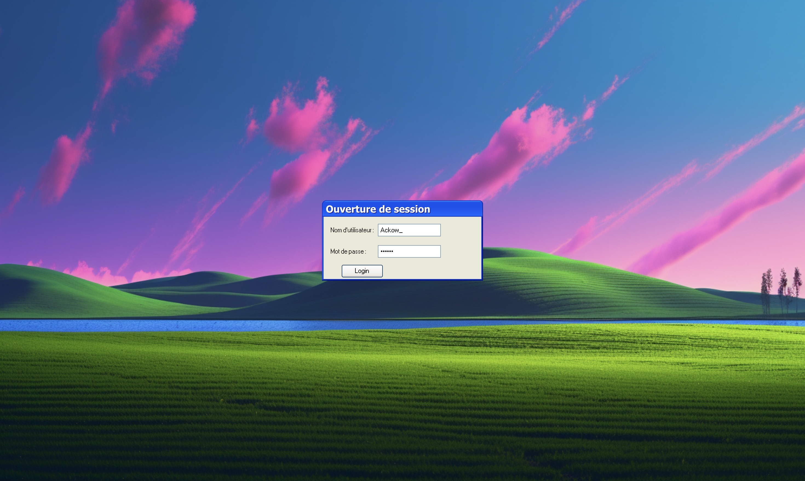
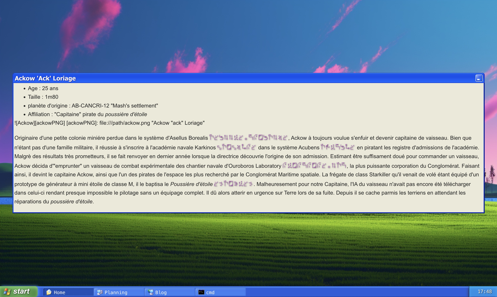
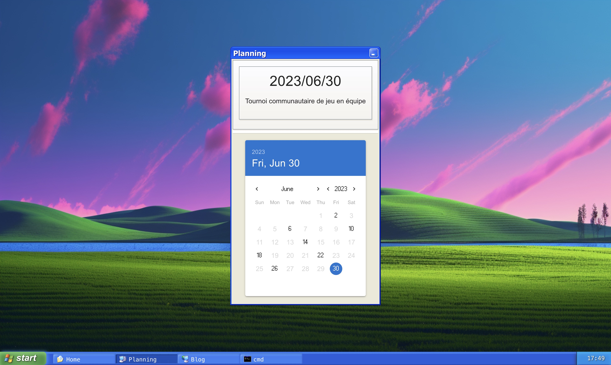
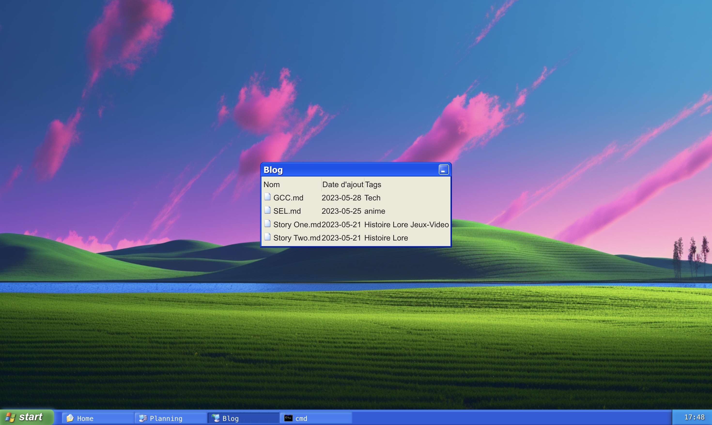
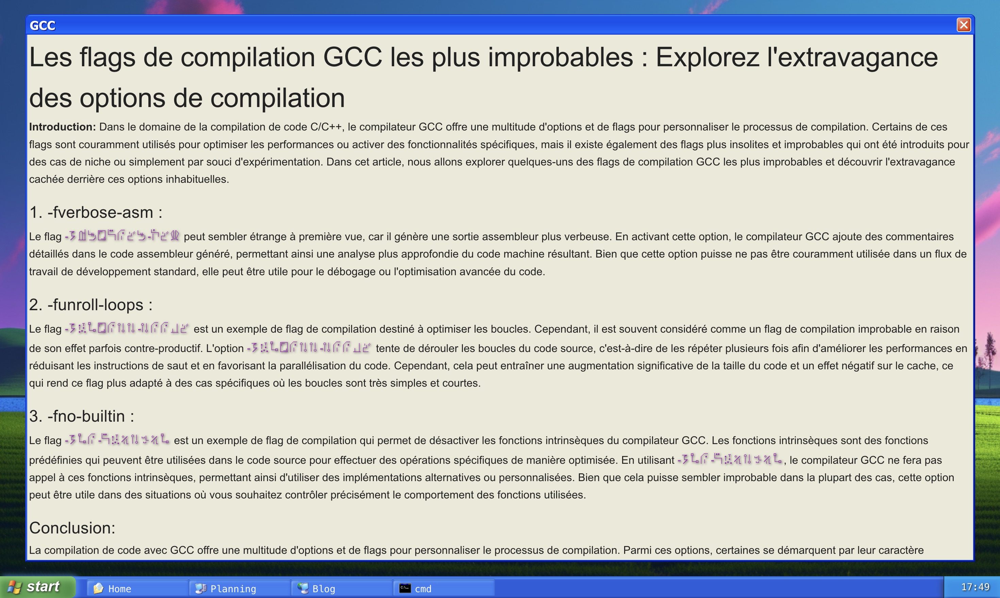

# Site Ackow

This website is a project simulating a windows operating system. It was created
to develop a Twitch streamer.

## Running the project

```
npm install
npm run
```

## Screen captures



The home page gives information on the streamer


In the planning window, users can see the streamer's next events.


The streamer can make blog posts in markdown format, with a custom font added
in accordance to the streamer's lore.


